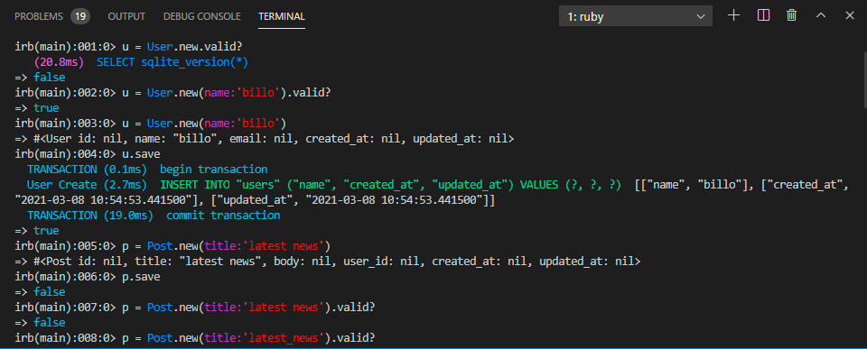
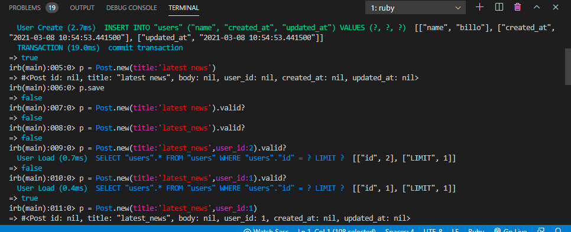
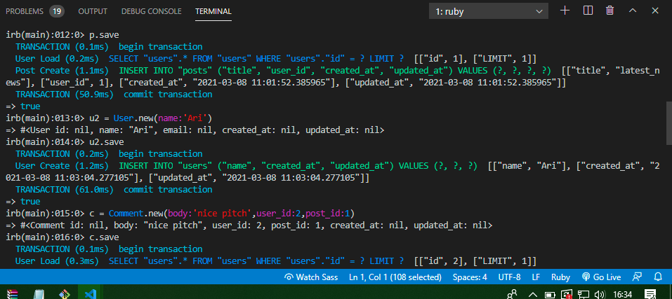
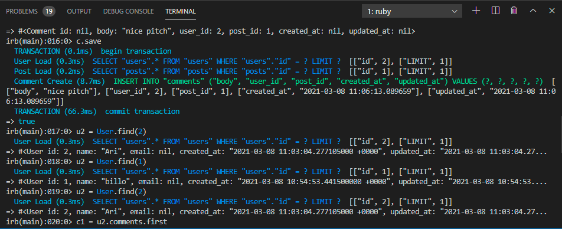
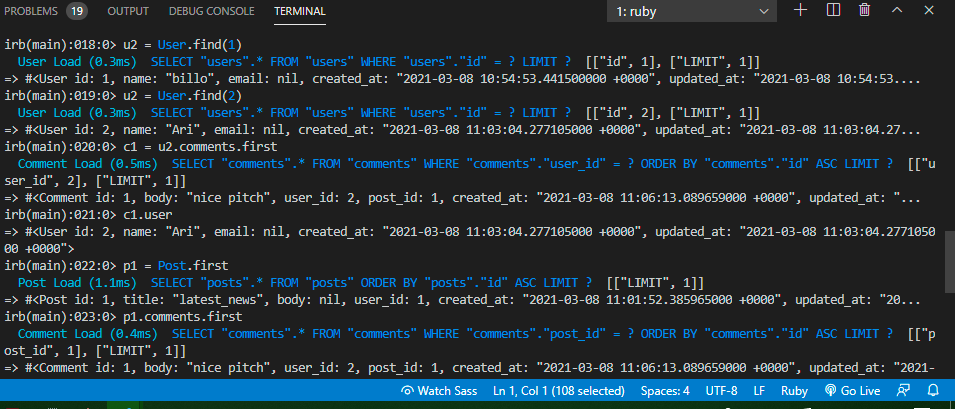
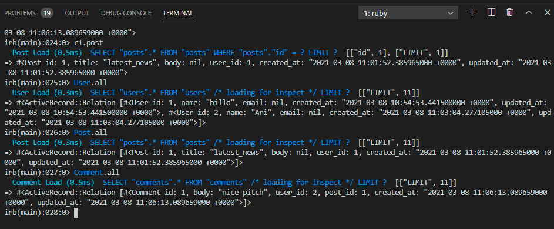

# Active Record

This project of active record, models, and associations to the tests  where a user can create a post and add comments to it.


## Screenshot








## Built With
 [RUBY](https://github.com/billodiallo/Rspec-tic_tic_toe)

## Getting Started

This is an example of how you may give instructions on setting up your project locally. Modify this file to match your project, remove sections that don't apply. For example: delete the testing section if the currect project doesn't require testing.

- To get a local copy up and running follow these simple example steps.

- Clone this repository with git clone ```https://github.com/billodiallo/micro-reddit.git``` using your terminal or command line.
- Change to the project directory by entering :
```cd micro-reddit``` in the terminal .

Open the terminal and write (Rails c) to open the rails console.
Now you can play around with the user, posts, and comment models.
Now you can check the validations and associations of these models.


## Prequisites

- Ruby installed on your local machine.
Terminal or similar to execute the program.
- Ruby on rails


## Authors

👤 Billo Dallio

- GitHub: [@billodiallo](https://github.com/billodiallo)
- Twitter: [@BilloDi83547008](https://twitter.com/BilloDi83547008)


## 🤝 Contributing

Contributions, issues, and feature requests are welcome!

Feel free to check the [issues page](https://github.com/billodiallo/micro-reddit/issues/2).

## Show your support

Give a ⭐️ if you like this project!

## 📝 License

This project is [MIT](LICENSE) licensed.
